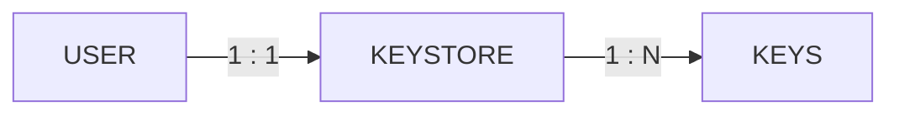

# Pseudo KMS

This project is designed to emulate a KMS.
It must not be used on a productive environment

Each User has one Keystore which includes all keys

# Rest

Following REST Calles are included by now:

    router.POST("/rotate", postRotateKey)  
    router.POST("/create/key", postCreateKey)  
    router.POST("/create/keystore", postCreateKeyStore)  
    router.POST("/create/user", postCreateUser)  
    router.POST("/sign", postSignWithKey)  
    router.POST("/encrypt", postEncrypt)  
    router.POST("/decrypt", postDecrypt)  
    router.GET("/get/key", getKey)

## Following JSON is consumed by the endpoints:

### /rotate

    {"username": "YOUR USERNAME", "token": "YOUR TOKEN", "keyname": "KEY TO ROTATE"}

### /create/key

    {"username": "YOUR USERNAME", "token": "YOUR TOKEN", "keytype": "SEE LIST", "keyname": "KEYNAME", "keyversion": 0}

### /create/keystore

    {"username": "YOUR USERNAME", "token": "YOUR TOKEN"}

### /create/user

    {"username": "YOUR USERNAME", "token": "YOUR TOKEN", "newusername": "NEW USERNAME", "newtoken": "NEW TOKEN"}

### /sign

    {"username": "YOUR USERNAME", "token": "YOUR TOKEN", "keyname": "KEY TO BE USED", "msg": "MESSAGE AS HEX"}

### /encrypt

    {"username": "YOUR USERNAME", "token": "YOUR TOKEN", "keyname": "KEY TO BE USED", "msg": "MESSAGE AS HEX"}

### /decrypt

    {"username": "YOUR USERNAME", "token": "YOUR TOKEN", "keyname": "KEY TO BE USED", "msg": "MESSAGE AS HEX"}

## Implementation

|                  | RSA | ECC |
|------------------|-----|-----|
| /rotate          | YES | YES |
| /create/key      | YES | YES |
| /create/keystore | YES | YES |
| /create/user     | -   | -   |
| /sign            | YES | YES |
| /encrypt         | YES | YES |
| /decrypt         | YES | YES |
| /get/key         | YES | YES |
| /delete/key      | NO  | NO  |

### RSA Supported "Key Types"

| Name                      | Planed | Supported/Implemented |
|---------------------------|--------|-----------------------|
| RSASSA_PSS_SHA_256        | YES    | NO                    |
| RSASSA_PSS_SHA_384        | YES    | NO                    |
| RSASSA_PSS_SHA_512        | YES    | NO                    |
| RSASSA_PKCS1_V1_5         | -      | YES                   |
| RSASSA_PKCS1_V1_5_SHA_256 | -      | YES                   |
| RSASSA_PKCS1_V1_5_SHA_384 | -      | YES                   |
| RSASSA_PKCS1_V1_5_SHA_512 | -      | YES                   |

### ECC Supported "Key Types"

| Name               | Planed | Supported/Implemented |
|--------------------|--------|-----------------------|
| ECDSA_P256         | -      | YES                   |
| ECDSA_P256_SHA_256 | -      | YES                   |
| ECDSA_P384_SHA_384 | -      | YES                   |
| ECDSA_P512_SHA_512 | -      | YES                   |

# Setup

1. Clone the repository
2. Edit the ENV file
3. Run `docker-compose up`
